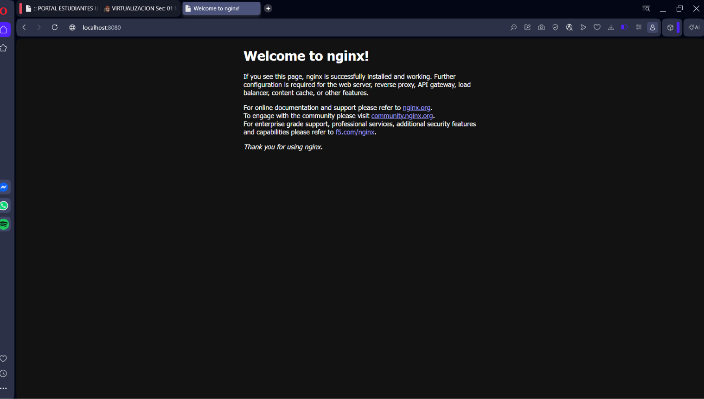

# virtualizacion

## Homework 05: Exposing Nginx with a Kubernetes Service

This branch (`hw-05`) exposes an Nginx deployment through a Kubernetes `NodePort` Service so it can be reached from the local machine. The Service is defined as code (Infrastructure as Code) using YAML manifests.

### Project structure

k8s/
├── deployment.yaml   # Nginx Deployment (1 replica, port 80)
└── service.yaml      # NodePort Service exposing Nginx
docs/
└── nginx-browser.png # Browser screenshot


### How to deploy

```bash
minikube start --driver=docker
kubectl create namespace hw
kubectl apply -f k8s/
kubectl get pods -n hw
```

### How to access the service

```bash
kubectl port-forward svc/nginx-service 8080:80 -n hw
```

Then open `http://localhost:8080` in the browser.

### Browser request to the Nginx service



### Output of `kubectl get svc -n hw`

```
NAME            TYPE       CLUSTER-IP       EXTERNAL-IP   PORT(S)        AGE
nginx-service   NodePort   10.104.255.240   <none>        80:30080/TCP   10m
```