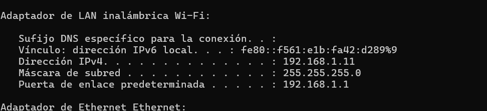
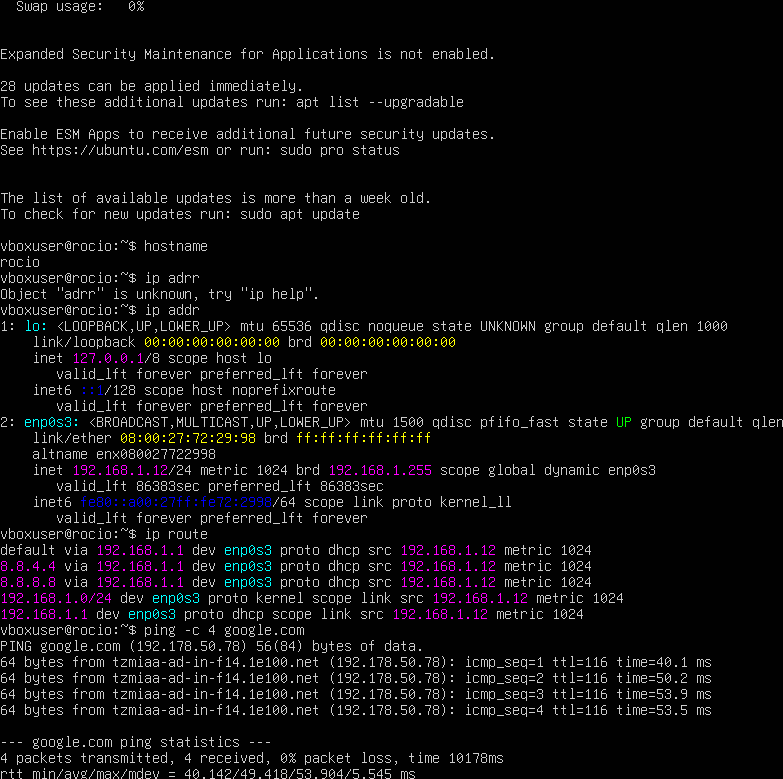
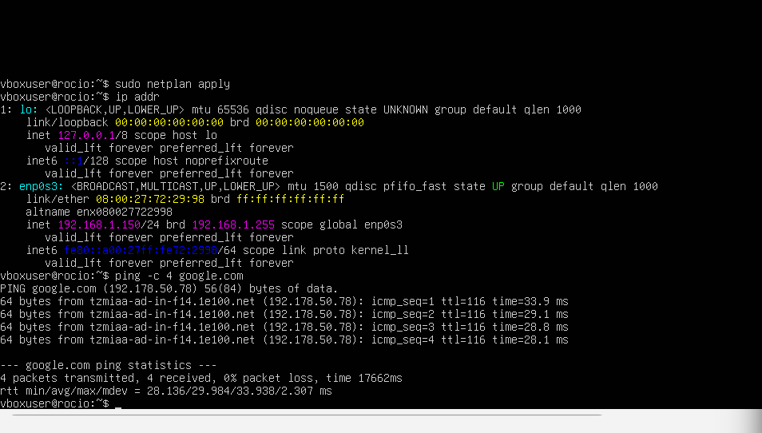
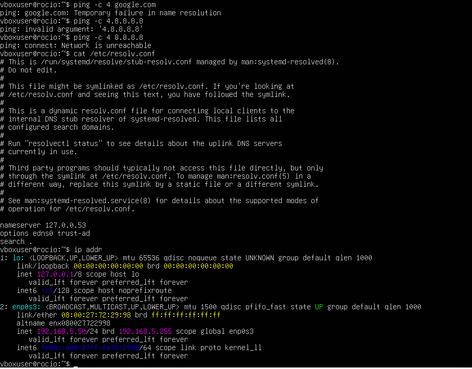

# virtualizacion
# HW-03 - Configuración de red en VirtualBox (modo Bridge)

**Hostname de la VM:** rocio

## Subred del hipervisor

Subred: `192.168.1.0/24`
IP del host: `192.168.1.11`
Gateway: `192.168.1.1`

## Escenario 1: Bridge + DHCP

IP obtenida automáticamente por DHCP: `192.168.1.12/24`, gateway `192.168.1.1`.
Ping a google.com exitoso, 0% de pérdida de paquetes.

## Escenario 2: Bridge + IP manual (dentro de la subred)

IP asignada manualmente: `192.168.1.150/24`, dentro de la subred del hipervisor (`192.168.1.0/24`).
Ping a google.com exitoso, 0% de pérdida de paquetes.

## Escenario 3: Bridge + IP manual (fuera de la subred)

IP asignada manualmente: `192.168.5.50/24`, fuera de la subred del hipervisor (`192.168.1.0/24`).
Se configuró la ruta con `on-link: true` para forzar el uso del gateway `192.168.1.1`.

Resultado: el ping a google.com **falló** (`Network is unreachable`), incluso al hacer ping directo a `8.8.8.8` (sin depender de DNS). Esto confirma que, aunque `on-link` le indica al kernel que confíe en el gateway, el adaptador en modo Bridge no logra completar la comunicación porque la IP asignada está fuera del rango de broadcast de la red física (`192.168.5.255` en vez de `192.168.1.255`), por lo que no puede resolver correctamente la ruta hacia el gateway real.

