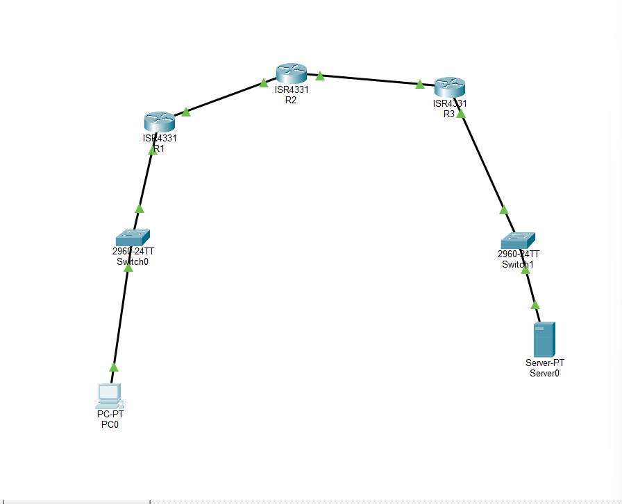
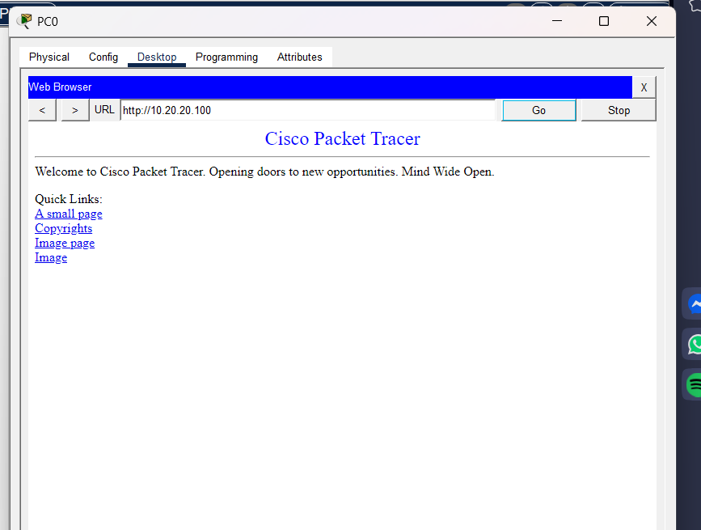
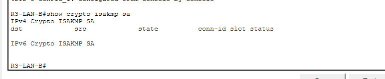

# HW-04: Configuración de IPSec entre dos redes

## Topología

PC-A (10.10.10.10) → R1 (200.0.0.1) → R2 "Internet" → R3 (201.0.0.2) → Server (10.20.20.100)

## Túnel IPSec

- Modo: Tunnel
- Peers: R1 (200.0.0.1) ↔ R3 (201.0.0.2)
- Encryption: AES-256
- Hash: SHA
- Autenticación: Pre-shared key

## Prueba de llamada HTTP

Desde PC-A, se llamó a `http://10.20.20.100` y el servidor respondió correctamente:

## Verificación del túnel IPSec

