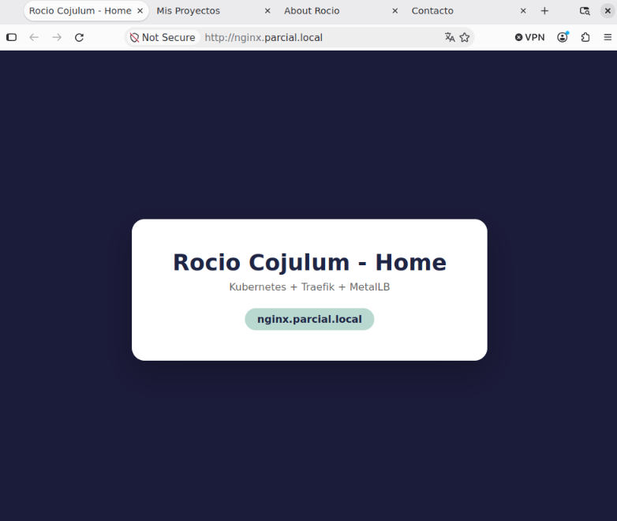
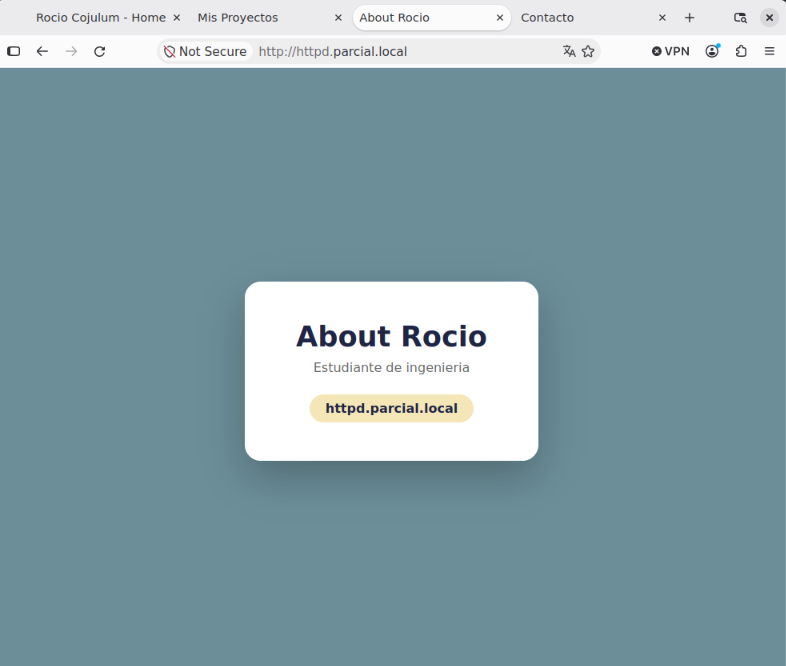
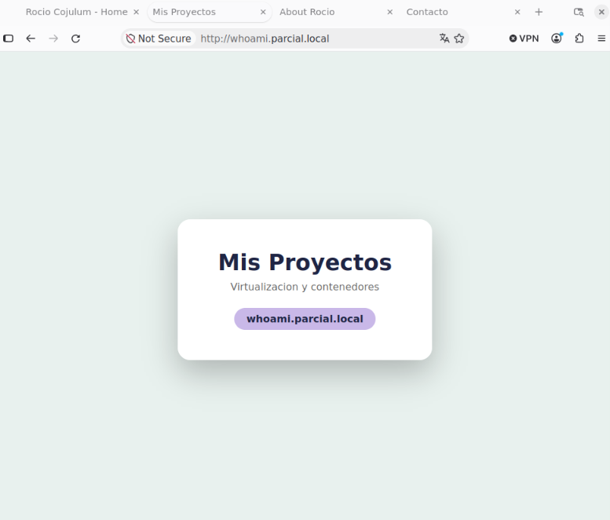
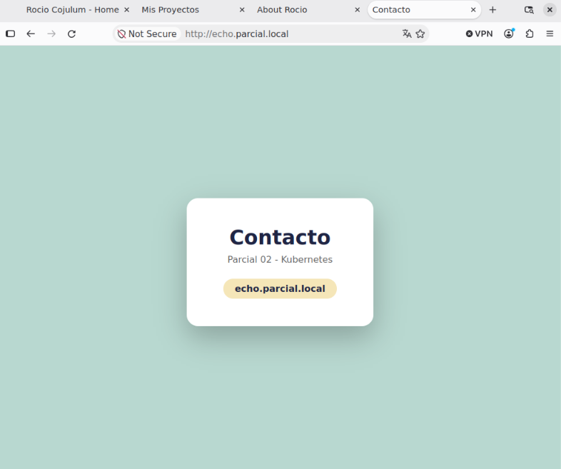

# virtualizacion
# Assessment 02

**Student:** Rocio Iveth Cojulum Juarez  
**Namespace:** `parcial-ricj`  
**Branch:** `assessment-02`

The cluster contains:

- MetalLB in the `metallb-system` namespace.
- Traefik in the `traefik` namespace.
- Four web applications in the `parcial-ricj` namespace.
- Four Kubernetes Services.
- Four Traefik IngressRoutes.
- Four local DNS records for the Traefik LoadBalancer.

## 1. MetalLB Configuration

MetalLB was installed in the `metallb-system` namespace:

```bash
kubectl apply -f https://raw.githubusercontent.com/metallb/metallb/v0.15.2/config/manifests/metallb-native.yaml
```

The IP address pool provides **one** IP address (`/32`) for the Traefik LoadBalancer.

Configuration file: `metallb/metallb-config.yaml`

The configured IP address is: `192.168.49.200`

Verification:

```bash
kubectl get pods -n metallb-system
kubectl get ipaddresspool -n metallb-system
kubectl get l2advertisement -n metallb-system
```


roiveth@Iveth:~/url/virtualizacion$ kubectl get pods -n metallb-system
NAME                          READY   STATUS    RESTARTS        AGE
controller-6c57b67fd4-fkbqg   1/1     Running   2 (7h37m ago)   8h
speaker-znv7q                 1/1     Running   2 (7h37m ago)   8h
roiveth@Iveth:~/url/virtualizacion$ kubectl get ipaddresspool,l2advertisement -n metallb-system
NAME                                      AUTO ASSIGN   AVOID BUGGY IPS   ADDRESSES
ipaddresspool.metallb.io/single-ip-pool   true          false             ["192.168.49.200/32"]

NAME                                          IPADDRESSPOOLS       IPADDRESSPOOL SELECTORS   INTERFACES
l2advertisement.metallb.io/l2-advertisement   ["single-ip-pool"]

## 2. Traefik Configuration

Traefik was installed in the `traefik` namespace using the official Helm chart:

```bash
helm repo add traefik https://traefik.github.io/charts
helm repo update
helm install traefik traefik/traefik --namespace traefik --create-namespace -f traefik/values.yaml
```

The configuration is stored in `traefik/values.yaml`. Traefik was configured as a Kubernetes `LoadBalancer` service.

Verification:

```bash
kubectl get svc -n traefik
```

The Traefik LoadBalancer received the following IP:

```
CLUSTER-IP:  10.100.191.66
EXTERNAL-IP: 192.168.49.200
```

roiveth@Iveth:~/url/virtualizacion$ kubectl get svc -n traefik
NAME      TYPE           CLUSTER-IP      EXTERNAL-IP      PORT(S)        AGE
traefik   LoadBalancer   10.100.191.66   192.168.49.200   80:31651/TCP   8h

## 3. Application Namespace

All four applications and their services were deployed in:

```
parcial-ricj
```

This namespace follows the required naming convention using the initials of the student's name.

```bash
kubectl get ns
```

## 4. Applications

Four web applications were created:

| Application | Service | Domain |
|---|---|---|
| Home | `app-nginx` | `nginx.parcial.local` |
| About | `app-httpd` | `httpd.parcial.local` |
| Projects | `app-whoami` | `whoami.parcial.local` |
| Contact | `app-echo` | `echo.parcial.local` |

The applications use Nginx containers with custom HTML pages stored in ConfigMaps. Each file in `apps/` contains a ConfigMap, a Deployment and a Service.

The Kubernetes configuration is located in `apps/`.

Verification:

```bash
kubectl get pods,svc,configmap -n parcial-ricj
```

roiveth@Iveth:~/url/virtualizacion$ kubectl get pods,svc,configmap -n parcial-ricj
NAME                              READY   STATUS    RESTARTS   AGE
pod/app-echo-7c6d9d5584-7r29x     1/1     Running   0          3h4m
pod/app-httpd-59998fc9dd-2vqj9    1/1     Running   0          3h4m
pod/app-nginx-667f76556-t5djt     1/1     Running   0          3h4m
pod/app-whoami-6469b556cb-lqt89   1/1     Running   0          3h4m

NAME                 TYPE        CLUSTER-IP      EXTERNAL-IP   PORT(S)   AGE
service/app-echo     ClusterIP   10.101.44.209   <none>        80/TCP    9h
service/app-httpd    ClusterIP   10.101.39.250   <none>        80/TCP    9h
service/app-nginx    ClusterIP   10.102.28.12    <none>        80/TCP    9h
service/app-whoami   ClusterIP   10.111.23.40    <none>        80/TCP    9h

NAME                         DATA   AGE
configmap/app-echo-html      1      3h4m
configmap/app-httpd-html     1      3h4m
configmap/app-nginx-html     1      3h4m
configmap/app-whoami-html    1      3h4m
configmap/kube-root-ca.crt   1      9h

## 5. Traefik Routing

Traefik was configured using `IngressRoute` resources, stored in `apps/10-ingressroutes.yaml`.

Routing rules:

```
nginx.parcial.local   -> app-nginx:80
httpd.parcial.local   -> app-httpd:80
whoami.parcial.local  -> app-whoami:80
echo.parcial.local    -> app-echo:80
```

Verification:

```bash
kubectl get ingressroute -n parcial-ricj
```

## 6. Local DNS Configuration

The following entry was added to the local `/etc/hosts` file:

```
127.0.0.1 nginx.parcial.local httpd.parcial.local whoami.parcial.local echo.parcial.local
```

> **Note about WSL:** the project runs on Ubuntu inside WSL with the Minikube Docker driver. In this setup the Docker network (`192.168.49.0/24`) is not reachable from the host, and `minikube tunnel` did not create a route to it. MetalLB did assign `192.168.49.200` to the Traefik Service (see section 2), but to reach it locally, port 80 of the Traefik Service is forwarded to `127.0.0.1`:
>
> ```bash
> sudo $(which kubectl) --kubeconfig $HOME/.kube/config \
>   port-forward -n traefik svc/traefik 80:80 --address 127.0.0.1
> ```
>
> On a setup where the LoadBalancer IP is reachable, the `hosts` entry would be:
>
> ```
> 192.168.49.200 nginx.parcial.local httpd.parcial.local whoami.parcial.local echo.parcial.local
> ```

## 7. Browser Verification

### Home

URL: `http://nginx.parcial.local`



### About

URL: `http://httpd.parcial.local`



### Projects

URL: `http://whoami.parcial.local`



### Contact

URL: `http://echo.parcial.local`



## 8. Final Verification

```bash
kubectl get pods -n metallb-system
kubectl get pods -n traefik
kubectl get pods,svc -n parcial-ricj
kubectl get ingressroute -n parcial-ricj
kubectl get svc -n traefik
```

All four web applications were accessed through their local domain names, routed by the single Traefik LoadBalancer.

## 9. Infrastructure as Code

All the configuration is stored in YAML files:

```
.
├── metallb/
│   └── metallb-config.yaml
├── traefik/
│   └── values.yaml
├── apps/
│   ├── 00-namespace.yaml
│   ├── 01-app-nginx.yaml
│   ├── 02-app-httpd.yaml
│   ├── 03-app-whoami.yaml
│   ├── 04-app-echo.yaml
│   └── 10-ingressroutes.yaml
└── docs/
    ├── nginx.png
    ├── httpd.png
    ├── whoami.png
    └── echo.png
```

This allows the configuration to be version controlled and reproduced as Infrastructure as Code.